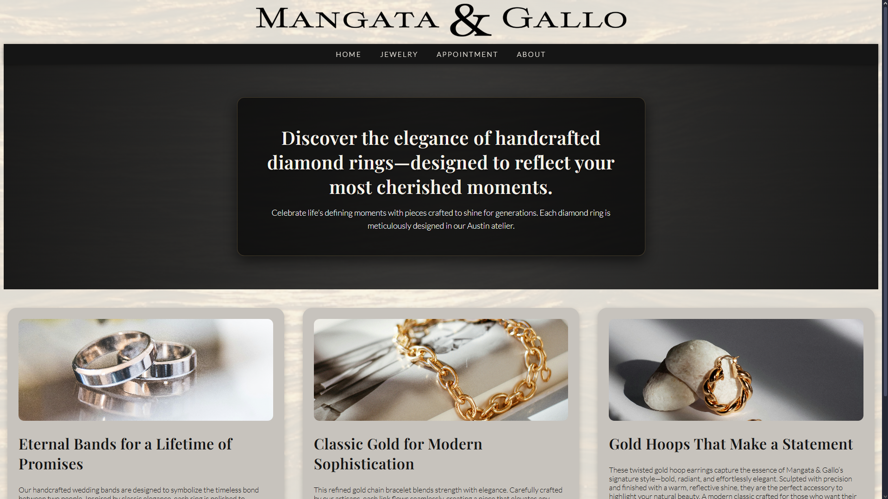

# Mangata & Gallo — Fictional Jewelry Store Website

A responsive landing page for **Mangata & Gallo**, a fictional luxury jewelry brand.  
Built as a front-end practice project using semantic HTML and modern CSS (Flexbox, variables, and responsive layout).

## Preview

## Features

- Semantic HTML layout (header, nav, main, sections, footer)
- Sticky navigation bar
- Hero section with centered callout
- Product cards with hover elevation
- CSS variables for theming and typography
- Responsive product grid (wraps on smaller screens)

## Tech Stack

- HTML5
- CSS3 (Flexbox, custom properties)
- Google Fonts (Playfair Display, Lato)
